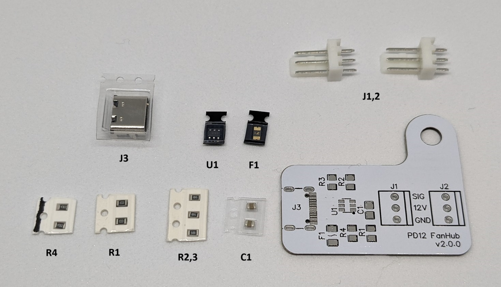

# PD12 FanHub

## PD12V FanHub v2.0.0

Type-C PD12V対応の電源からPCファン2台を直接駆動できる基板です。

取付例。

### 部品リスト

| 記号 | 品名 | 個数 |
| --- | --- | --- |
| - | PD12 FahHub基板 | 1 |
| U1 | CH221K | 1 |
| F1 | リセッタブルヒューズ MF-NSMF050-2 | 1 |
| C1 | 1uF | 1 |
| R1 | 1kR | 1 |
| R2,3 | 5.1kR | 2 |
| R4 | 47kR | 1 |
| J1,2 | 3PINファン用コネクタ | 2 |
| J3 | Type-Cコネクタ(16pin SMD) | 1 |

### 必要工具

1. ハンダ付け用品、ハンダ吸い取り機
1. ピンセット
1. ルーペ（マイクロスコープがあるとType-Cコネクタの実装が楽です。）

### 組み立て方

1. J3,U1を先に実装するとハンダ付けがやりやすいと思います。
1. U1は取付向きに注意してください。ドット部が1ピンになるように、もしくは基板のU1ラベルとICの刻印の向きが揃うようにしてください。
1. J1,2のファン用コネクタはSIGピンだけ先にハンダ付けし、位置を調整してから残りをハンダ付けをすると安全です。（SIGピンは使用していないので最悪剥がれても12V,GNDが正常なら動きます。
1. 取付用の穴はM4サイズです。

### QA

1. Q.何で手ハンダ用のパッドじゃないの？ A.好み。

### 注意事項

- ホスト側がPD12V(PD3.0/2.0)に対応している必要があります。
- ファンは2個まで取り付けられますが合計0.5A以下で使用してください。
- ファン速度は固定のため静音モデルのファンを使用することをお勧めします。
- 5V/9V/12VまではR4の抵抗を変更することで取り出す電圧を変えることはできます。詳しくはCH221Kのデータシートを参照してください。
- 15V以上はヒューズの定格を超えるため変更しないでください。

### 資料

[回路図](docs/ynl_pd12fanhub_schematic_v2.0.0.pdf)
